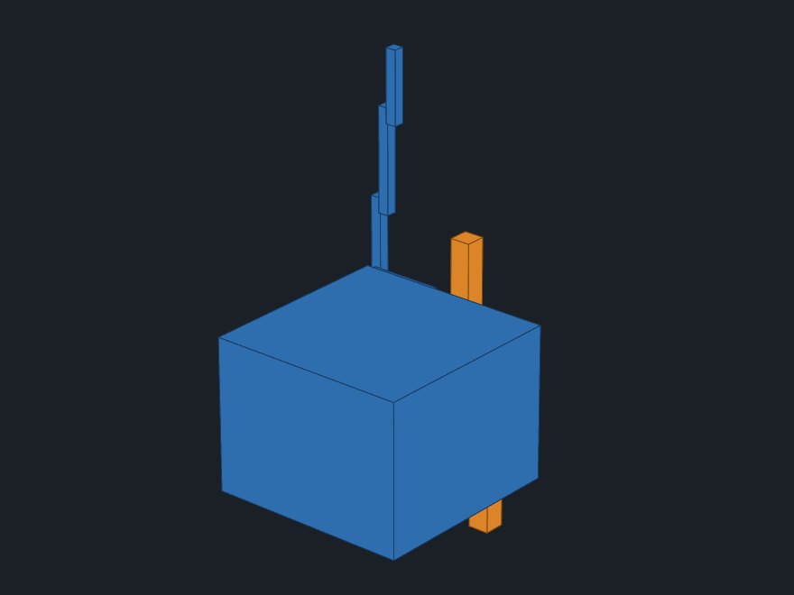

# kinematic_planner_ros2



A suite of ROS 2 packages implementing standalone collision-free **RRT\*** and **Informed RRT\*** path planning for robot manipulators, built from the ground-up to serve as an educational complement of the more feature-rich and standard motion planning framework, [MoveIt](https://github.com/moveit/moveit2).  Collision checking uses the
[Flexible Collision Library (FCL)](https://github.com/humanoid-path-planner/hpp-fcl) directly.
Forward kinematics use the [Robotics Toolbox for Python](https://github.com/petercorke/robotics-toolbox-python), and the robot is described entirely by a URDF.

The included example robot is a 3-DOF serial manipulator (3R arm).
The planner supports any N-DOF robot whose links use **convex collision primitives**
(box, cylinder, sphere) in their URDF `<collision>` elements.

---

## Components

| Capability | Implementation |
|---|---|
| Sampling-based planning | Custom RRT\* and Informed RRT\* in `scripts/planner_node.py` and `scripts/informed_rrt_star_node.py` |
| Collision checking | FCL bounding-volume and signed-distance modes in `collision/collision_utils.py` |
| Forward kinematics | Robotics Toolbox `ERobot` loaded from URDF |
| Generic robot interface | `robot/robot_config.py` — parses joint limits, link names, and kinematic topology from a raw URDF string using stdlib `xml.etree`; no external config files needed |
| Robot-agnostic obstacle scene | `scripts/obstacle_publisher.py` — all geometry parameters are ROS 2 parameters, nothing hardcoded |

---

## Workspace Layout

```
kinematic_planner_ros2/
└── src/
    ├── kinematic_planner/           # main package — planner, collision, robot model
    │   ├── launch/
    │   │   └── planner.launch.py    # single entry point; brings up robot_state_publisher,
    │   │                             # joint_state_publisher, robot_geom_publisher,
    │   │                             # obstacle_publisher, and the selected planner node
    │   └── kinematic_planner/
    │       ├── robot/
    │       │   ├── robot_config.py  # RobotConfig dataclass; from_urdf() classmethod
    │       │   └── legacy/urdf_parser.py  # educational FK/Jacobian/IK reference, not used at runtime
    │       ├── collision/
    │       │   └── collision_utils.py  # FCL helpers
    │       └── scripts/
    │           ├── planner_node.py          # RRT* ROS 2 node
    │           ├── informed_rrt_star_node.py# Informed RRT* ROS 2 node
    │           ├── obstacle_publisher.py    # publishes scene obstacles
    │           └── robot_geom_publisher.py  # publishes robot link geometry from URDF
    ├── robot_3r_description/        # URDF/xacro for the example 3R robot
    └── kinematic_planner_interfaces/ # custom ROS 2 message definitions
```

---

## Prerequisites

### System

- **Ubuntu 22.04** (Jammy) — tested environment
- **ROS 2 Humble** (desktop install recommended)
- **xacro** — for processing the robot description:
  ```bash
  sudo apt install ros-humble-xacro
  ```
- **robot_state_publisher** and **joint_state_publisher** — the launch file
  runs both nodes to publish `/robot_description` and a start `/joint_states`:
  ```bash
  sudo apt install ros-humble-robot-state-publisher ros-humble-joint-state-publisher
  ```

### Python packages

Install into your ROS 2 Python environment:

```bash
pip install \
  "roboticstoolbox-python>=1.3.1" \
  "spatialgeometry>=1.3.0" \
  spatialmath-python \
  transforms3d \
  trimesh \
  "numpy>=2.0"
```

> **Note on `numpy` 2.x:** `roboticstoolbox-python` releases before 1.2 and
> `spatialgeometry` releases before 1.3.0 ship compiled extensions built
> against the NumPy 1.x ABI and fail to import under NumPy 2.x
> (`ImportError: numpy.core.multiarray failed to import`). The versions
> pinned above are the first to publish NumPy 2-compatible wheels.

Install the FCL Python bindings:

```bash
pip install python-fcl
```

> **Note on `python-fcl`:** if `pip install python-fcl` fails, install the system
> FCL library first:
> ```bash
> sudo apt install libfcl-dev
> pip install python-fcl
> ```

---

## Build

```bash
cd kinematic_planner_ros2

# source your ROS 2 installation
source /opt/ros/humble/setup.bash

# build all three packages
colcon build --packages-select kinematic_planner_interfaces robot_3r_description kinematic_planner

# source the workspace overlay
source install/setup.bash
```

---

## Run

To watch planning happen live in RViz, showing the final path as markers
rather than the animated sweep the hero GIF above shows:

```bash
ros2 launch kinematic_planner planner.launch.py &
rviz2 -d src/robot_3r_description/rviz/view_3r_demo.rviz
```

### RRT\* planner (default)

```bash
ros2 launch kinematic_planner planner.launch.py
```

Plan to a specific goal configuration:

```bash
ros2 launch kinematic_planner planner.launch.py goal_config:="[1.5, -0.3, 0.6]"
```

Enable the dense obstacle ring (10 obstacles standing on the platform around the robot,
the scene shown in the hero GIF above); the default `goal_config` is collision-free
against both scenes:

```bash
ros2 launch kinematic_planner planner.launch.py is_dense:=true
```

### Informed RRT\* planner

Informed RRT\* runs the same RRT\* algorithm until a first solution is found, then
focuses all subsequent sampling inside the smallest ellipsoid in C-space that can contain
any path of equal or lower cost — converging to the optimum faster than plain RRT\*.

```bash
ros2 launch kinematic_planner planner.launch.py algorithm:=informed_rrt_star
```

### Verify a path was found

```bash
ros2 topic echo /smpb_planner/jsp_path --once
```

You should see a `JointSpacePath` message with waypoints from the start configuration
to the goal.

---

## Launch arguments

| Argument | Default | Description |
|---|---|---|
| `goal_config` | `[0.8, -0.5, 0.5]` | Goal joint configuration in radians |
| `is_dense` | `false` | `true` → 10-obstacle ring; `false` → 2 sparse obstacles |
| `check_collision` | `true` | Enable FCL collision checking |
| `collision_checker` | `proximity` | `proximity` (signed distance) or `bvol` (bounding volume) |
| `rrts_max_iter` | `2000` | Maximum RRT\* iterations |
| `platform_height` | `0.755` | Height of the robot's mounting platform; obstacles rest on top of the platform |
| `verbose` | `false` | Print per-iteration planning logs |
| `world_frame` | `world` | Fixed frame name |
| `base_link_name` | `base_link` | Robot base link name |
| `dense_ring_radius` | `0.45` | Radius of the dense obstacle ring (metres) |

---

## Planner node parameters

All parameters can be overridden at runtime with `--ros-args -p <name>:=<value>`.

| Parameter | Default | Description |
|---|---|---|
| `robot_description` | — | URDF XML string (set by launch file) |
| `goal_config` | joint-limit midpoints | Goal joint angles in radians |
| `planning_algorithm` | `rrt_star` | Planning algorithm (`rrt_star` only for now) |
| `rrts_expand_dist` | `0.3` | Max tree growth per iteration (radians) |
| `rrts_path_resolution` | `0.1` | Interpolation step size (radians) |
| `rrts_max_iter` | `300` | Maximum iterations |
| `rrts_connect_circle_dist` | `20` | Neighbour search radius multiplier |
| `rrts_search_until_max_iter` | `false` | Keep improving after first solution |
| `use_goal_biased_sampling` | `false` | Bias sampling toward goal |
| `rrts_goal_sample_rate` | `0.3` | Goal bias probability (when enabled) |
| `collision_checker` | `proximity` | `proximity` or `bvol` |
| `min_obs_dist` | `0.1` | Minimum safe clearance from obstacles (metres) |
| `random_seed` | `42` | Seed for reproducible results |
| `disabled_collision_pairs` | `[""]` | Additional self-collision pairs to skip beyond the joint-adjacent pairs `RobotConfig.from_urdf` already auto-excludes, as `"link_a:link_b"` strings |

---

## Using a different robot

1. Add your URDF or xacro to the workspace (or point to an existing package).
2. Edit `src/kinematic_planner/launch/planner.launch.py` — change `urdf_file` to your robot's xacro path.
3. `RobotConfig.from_urdf` auto-excludes every joint-adjacent link pair from self-collision
   checking, computed from the URDF's own joint parent/child structure, so no manual listing
   of adjacent pairs is required. Use `disabled_collision_pairs` only for further exclusions
   on top of the automatic adjacency exclusion, e.g. non-adjacent link pairs your robot's
   geometry makes intentionally non-colliding (equivalent to extra `<disable_collisions>`
   entries in an SRDF):
   ```bash
   ros2 launch kinematic_planner planner.launch.py \
     disabled_collision_pairs:="['base_link:link3']"
   ```
4. Set `platform_height` to your robot's mounting platform height, so the
   built-in obstacle scenes rest on top of the platform instead of floating through the platform.

The robot must use **convex collision primitives** (`<box>`, `<cylinder>`, or `<sphere>`)
in its URDF `<collision>` elements.  Mesh-based collision geometry is not supported.

---

## Algorithm references

- **RRT\***: Karaman & Frazzoli, "Sampling-based algorithms for optimal motion planning," *IJRR* 2011.
- **Informed RRT\***: Gammell, Srinivasa & Barfoot, "Informed RRT\*: Optimal Sampling-based Path Planning Focused via Direct Sampling of an Admissible Ellipsoidal Heuristic," *IROS* 2014.
- Implementation structure adapted from [AtsushiSakai/PythonRobotics](https://github.com/AtsushiSakai/PythonRobotics).

---

## License

MIT
