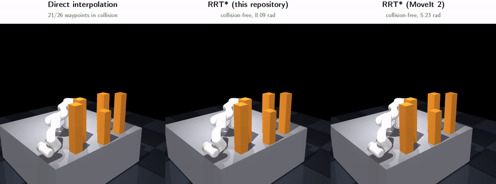
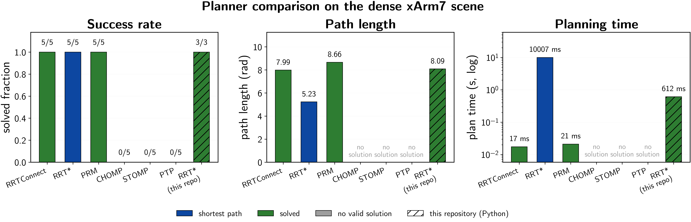
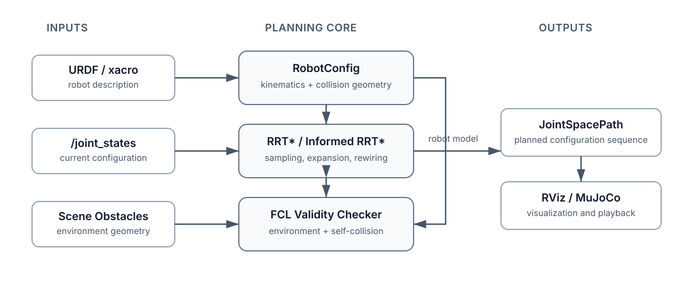

# kinematic_planner_ros2

[](https://github.com/coenwerem/kinematic_planner_ros2/actions/workflows/ci.yml)


**Sampling-Based Manipulator Motion Planning in ROS 2, Implemented from Scratch**

`kinematic_planner_ros2` implements RRT* and Informed RRT* in joint space, derives robot models from URDF, and checks environment and self-collisions through FCL. Sampling, nearest-neighbor expansion, rewiring, edge validation, collision geometry, and the ROS 2 entrypoints each occupy a separate module; the planner core, however, does not depend on ROS.

`kinematic_planner`'s RRT* and six MoveIt 2 pipelines solve the same dense xArm7 query, and every
returned path is revalidated waypoint by waypoint. Four of the seven return a valid path.
`kinematic_planner`'s RRT* solves it in 0.612 s at 8.091 rad of joint-space path length. The
[comparison](#planner-comparison) reports all seven.

<p align="center">
  
</p>

All three panels replay the benchmarked query [below](#planner-comparison). The end effector
crosses a field of six obstacles. The direct path, the straight-line joint-space interpolation
between start and goal, drags the arm through them (left, red), while `kinematic_planner`'s RRT*
and MoveIt's OMPL RRT* both lift the arm over. The FCL collision checker tests every frame of
every panel and tints a panel red while its configuration is in collision.

---

## Features

| Component | Detail |
|---|---|
| **Planners** | RRT* and Informed RRT* built on the shared `RRTPlannerBase` in `planning/tree.py`, with deterministic seeding and per-iteration cost logging |
| **Robot models** | N-DOF serial manipulators parsed from URDF, including joint limits and kinematic topology; no robot-specific Python classes |
| **Collision checking** | FCL environment and self-collision queries over box, sphere, cylinder, and triangle-mesh geometry taken from URDF `<collision>` elements |
| **ROS 2 integration** | Jazzy nodes, launch files, joint-state and scene interfaces, RViz markers, and custom path messages |
| **Evaluation** | A convergence benchmark of RRT* against Informed RRT*, and a comparison of `kinematic_planner`'s RRT* with six MoveIt 2 planners on one query |
| **Recorded checks** | Every rendered demo prints the outcome of its collision checks: whether the direct path is in collision, and whether each returned waypoint is collision-free |

Trials that need repetition run on the 3R chain; the cluttered-workspace scenes run on the 7-DOF
xArm7. [Limitations](#limitations) lists what the package does not implement.

---

## Planner Comparison

**Planners.** The benchmark compares seven planners on a single planning query: OMPL RRTConnect,
OMPL RRT*, OMPL PRM, CHOMP, STOMP, and Pilz PTP through MoveIt 2, and `kinematic_planner`'s RRT*.

**Planning query.** The scene contains six obstacles inside the robot's reachable workspace. Each
planner receives the same joint-space query: a start and goal configuration whose end-effector
positions relative to the base link are (0.33, -0.53, 0.09) and (0.38, 0.54, 0.32) meters, so the
end effector must cross the obstacle field rather than rotate in place. Sampling the direct path
between those two configurations at 26 points puts **21 of the 26 in collision**. At zero
clearance the two collision checkers agree on all 26 samples.

**Protocol.** Each MoveIt pipeline ran 5 trials at a 10 s budget. `kinematic_planner`'s RRT*
terminates on iteration count rather than on a clock, so it ran 3 trials at 20,000 iterations, 2
cm clearance, neighbor-radius multiplier 25, and goal-biased sampling at probability 0.2; the
launch defaults under [ROS 2 Interface](#ros-2-interface) differ. A trial succeeds only when every
waypoint of the returned trajectory passes MoveIt's `/check_state_validity`, which tests
self-collision, environment collision, and joint limits against the planning scene. Validation
covers the waypoints and not the segments between them.

| Planner | Pipeline | Success | Plan time (s) | Path length (rad) | Waypoints |
|---|---|:---:|---:|---:|---:|
| RRTConnect | OMPL | 5/5 | 0.017 | 7.990 | 39 |
| RRT\* | OMPL | 5/5 | 10.007 | 5.233 | 29 |
| PRM | OMPL | 5/5 | 0.021 | 8.664 | 37 |
| CHOMP | CHOMP | 0/5 | -- | -- | -- |
| STOMP | STOMP | 0/5 | -- | -- | -- |
| PTP | Pilz | 0/5 | -- | -- | -- |
| **RRT\*** | `kinematic_planner` | 3/3 | 0.612 | 8.091 | 41 |

Plan time, path length, and waypoints are medians over successful trials.

RRTConnect, PRM, OMPL's RRT*, and `kinematic_planner`'s RRT* solve the query; CHOMP, STOMP, and
Pilz PTP return no valid path in any of their 5 trials. CHOMP and STOMP both initialize from the
direct path, and neither returned a collision-free trajectory. Pilz PTP runs no collision-aware
search, and MoveIt's `ValidateSolution` adapter rejects the direct path it returns.

Among the four that solve the query, `kinematic_planner`'s RRT* places third on both plan time
and path length. RRTConnect and PRM plan roughly thirty times faster and return paths within
0.6 rad of it. OMPL's RRT* returns the shortest path, 5.233 rad against the 7.990 to 8.664 of
the other three, and uses its full 10 s budget.

<p align="center">
  
</p>

Planners marked `no solution` returned either a path that failed per-waypoint revalidation
or no path at all; the length and time panels cover successful trials only.

The plan-time column separates two implementations and not two algorithms: `kinematic_planner`'s
is Python with its own collision code, MoveIt's is compiled C++ with its own. The two RRT* rows
also ran to different horizons, 10 s of optimization against 0.612 s. An anytime planner given
longer returns a shorter path, so 5.233 against 8.091 is not the gap between the two
implementations at equal
effort. One query on one robot cannot characterize either implementation across a distribution
of environments.

```bash
ros2 launch xarm7_moveit_config move_group.launch.py                             # terminal 1
python3 tools/benchmark_moveit_planners.py --out results/moveit_comparison.json  # terminal 2
python3 tools/benchmark_local_planner.py results/moveit_comparison.json          # adds kinematic_planner's RRT*
python3 tools/plot_moveit_comparison.py results/moveit_comparison.json           # figure
python3 tools/render_moveit_demo.py results/moveit_comparison.json               # demo animation
```

The table, the figure, and the animation all come from one recorded run in
`results/moveit_comparison.json`.

<details>
<summary><strong>Planning-Scene Note for Rebuilding the MoveIt Side</strong></summary>

Obstacles are added as a scene **diff**. Applying a `PlanningScene` with `is_diff` set to false
replaces the whole scene including the allowed-collision matrix built from the SRDF, after which
every adjacent link pair reports a false collision and no state validates.
`benchmark_moveit_planners.py` checks that the matrix is non-empty before it starts, and confirms
the direct path is in collision before planning.

</details>

---

## Convergence Benchmark

The comparison measures success, plan time, and path length on one query. Whether a planner keeps
shortening its path after the first solution is a separate property, visible only across many
trials, and each trial on the 7-DOF arm costs far more collision checking than one on the 3R
chain. The second benchmark therefore runs on the 3R chain, where 20 trials finish in seconds:
`tools/benchmark_planners.py` runs both planners in this package on the bundled 3R
dense-obstacle scene over 20 deterministic RNG seeds and 800 iterations per trial.

<p align="center">
  
</p>

Median best cost so far against iteration, with shaded interquartile ranges. Curves begin at the
first iteration a trial returns a solution. Cost on that axis is joint-space path length in
radians, the quantity the comparison table reports as path length.

Both planners sample uniformly until a first solution exists, so at matched RNG seeds their early
behavior is identical and both reach a first solution in the same 11 of 20 trials within the
800-iteration budget. After that, Informed RRT* restricts sampling to the admissible ellipsoidal
subset its current solution cost defines, and that restriction is the only difference between the
two runs. Its median separates from the RRT* median and keeps falling where the RRT* median
flattens; across the 11 trials both solved, Informed RRT* finished lower in 10 and level in the
remaining one. The axis is iteration count and not time, so the curves say nothing about
wall-clock cost, which varies with the robot, collision geometry, scene complexity, and
hardware.

```bash
python3 tools/benchmark_planners.py --trials 20 --max-iter 800
```

---

## Demonstrations

`tools/render_moveit_demo.py` rebuilds the three-panel animation at the top of this page from
the recorded obstacle positions, so the animation and the table describe the same scene. The
renderer resamples the direct path at 136 frames and finds 100 of them in collision. The
26-sample check in the comparison scores the same path at 21 of 26.

The three scenes below are separate renders on the same robot and table, driven by the planner
and FCL collision checker the ROS 2 nodes use, with MuJoCo animating the returned joint-space
path.

| Scene | Planning problem | Media |
|---|---|---|
| `sparse` | 3 obstacles requiring a collision-free detour | [GIF](media/xarm7_demo.gif) / [MP4](media/xarm7_demo.mp4) |
| `tall` | 4 taller obstacles forcing the arm under or around the obstacle field | [GIF](media/xarm7_tall_demo.gif) / [MP4](media/xarm7_tall_demo.mp4) |
| `dense` | 6 obstacles in a tighter workspace | [GIF](media/xarm7_dense_demo.gif) / [MP4](media/xarm7_dense_demo.mp4) |

<p align="center">
  
  
</p>

For each recording, `tools/render_xarm7_demo.py` prints three checks rather than asserting them
silently: whether the direct path is in collision, whether every returned waypoint is
collision-free, and whether the path begins and ends at the requested configurations.

Playback is kinematic: the renderer drives joint positions along the planned path, leaving
torque limits, contact forces, tracking error, and time parameterization untested. The bundled
xArm7 collision model uses convex primitives; triangle-mesh collision support lives in
`collision/robot_collision_model.py`, exercised by the collision-model tests.

```bash
colcon build --packages-select \
  xarm7_description kinematic_planner_interfaces robot_3r_description kinematic_planner
source install/setup.bash

python3 tools/render_xarm7_demo.py --scene sparse   # also: tall, dense
python3 tools/render_demo.py                        # 3R chain
```

`src/xarm7_description/urdf/xarm7.urdf` and its meshes were adapted from the MIT-licensed
[`frogger`](https://github.com/albertli24/frogger) xArm7 model. See
`src/xarm7_description/NOTICE.md` for provenance and modifications.

---

## Architecture

Each module below occupies one file. Nothing under `planning/` imports ROS, and under
`collision/` only `collision_utils.py` does, using `shape_msgs` and `geometry_msgs` types rather
than `rclpy`. The nodes translate robot-state and scene messages into planner inputs and publish
the joint-space path that comes back.

<p align="center">
  
</p>

| Module | Implementation |
|---|---|
| RRT* | `planning/rrt_star.py` |
| Informed RRT* | `planning/informed_rrt_star.py` |
| Nearest neighbor, steer, choose parent, rewire | `planning/tree.py` |
| URDF robot metadata | `robot/robot_config.py` |
| Robot collision geometry | `collision/robot_collision_model.py` |
| Environment collision checking | `collision/collision_utils.py` |
| Self-collision checking | `collision/self_collision.py` |
| ROS 2 planner nodes | `scripts/planner_node.py`, `scripts/informed_rrt_star_node.py` |
| Robot geometry publisher | `scripts/robot_geom_publisher.py` |
| Scene publisher | `scripts/obstacle_publisher.py` |

The renderers and benchmark scripts sit outside the package under `tools/`, listed under
[Project Structure](#project-structure).

---

## Quick Start

### Prerequisites

Developed and tested on Ubuntu 24.04 (Noble), ROS 2 Jazzy, and Python 3.12.

```bash
sudo apt install \
  ros-jazzy-xacro \
  ros-jazzy-robot-state-publisher \
  ros-jazzy-joint-state-publisher \
  libfcl-dev

pip install \
  "roboticstoolbox-python>=1.3.1" \
  "spatialgeometry>=1.3.0" \
  spatialmath-python \
  transforms3d \
  trimesh \
  python-fcl \
  "numpy>=2.0"
```

Rendering the demos and figures additionally needs MuJoCo, `imageio`, `matplotlib`, `Pillow`,
and `ffmpeg` on the path:

```bash
pip install mujoco imageio matplotlib pillow
sudo apt install ffmpeg
```

The MoveIt comparison additionally needs the MoveIt 2 planning pipelines:

```bash
sudo apt install \
  ros-jazzy-moveit-ros-move-group \
  ros-jazzy-moveit-planners-ompl \
  ros-jazzy-moveit-planners-chomp \
  ros-jazzy-moveit-planners-stomp \
  ros-jazzy-pilz-industrial-motion-planner \
  ros-jazzy-moveit-kinematics
```

### Build

```bash
git clone https://github.com/coenwerem/kinematic_planner_ros2.git
cd kinematic_planner_ros2
source /opt/ros/jazzy/setup.bash
colcon build
source install/setup.bash
```

### Usage

```bash
# RRT* with the default goal configuration
ros2 launch kinematic_planner planner.launch.py

# a specific goal
ros2 launch kinematic_planner planner.launch.py goal_config:="[1.5, -0.3, 0.6]"

# Informed RRT*
ros2 launch kinematic_planner planner.launch.py algorithm:=informed_rrt_star

# visualize the 3R chain
ros2 launch kinematic_planner planner.launch.py &
rviz2 -d src/robot_3r_description/rviz/view_3r_demo.rviz
```

The RRT* node publishes on `smpb_planner/jsp_path` and the Informed RRT* node on
`informed_rrts/jsp_path`:

```bash
ros2 topic echo /smpb_planner/jsp_path --once
```

---

## Collision Model

`collision/robot_collision_model.py` builds one FCL object per URDF `<collision>` element,
applies that element's `<origin>` transform, and accepts several elements on one link. Boxes,
spheres, and cylinders map to FCL primitives; `<mesh>` geometry loads through `trimesh` into an
`fcl.BVHModel`. `collision/collision_utils.py` answers robot-obstacle proximity and collision
queries. `collision/self_collision.py` checks the link pairs that `robot/robot_config.py`
returns after excluding adjacent links and any disabled pairs.

Supply further self-collision exclusions through `disabled_collision_pairs`:

```bash
ros2 launch kinematic_planner planner.launch.py \
  disabled_collision_pairs:="['base_link:link3']"
```

### Using Another Robot

The planner derives its model from URDF, so robot-specific Python classes are unnecessary:

1. Add or depend on the robot's URDF/xacro package.
2. Point a launch file at the robot description and pass it through `robot_description`.
3. Supply any additional non-adjacent self-collision exclusions through
   `disabled_collision_pairs`.
4. Set the example scene's `platform_height` when using the bundled obstacle publisher.

Planning then runs over the full joint space the URDF exposes. Explicit planning-group selection
for large branched robots is not implemented.

---

## ROS 2 Interface

The bundled launch file brings up the robot description, a joint-state source, the robot
geometry publisher, the obstacle publisher, and a planner. The defaults below describe the
shipped configuration; the benchmark in [Planner Comparison](#planner-comparison) overrides five
of them.

<details>
<summary><strong>Launch Arguments</strong></summary>

| Argument | Default | Description |
|---|---|---|
| `goal_config` | `[0.8, -0.5, 0.5]` | Goal joint configuration in radians |
| `algorithm` | `rrt_star` | `rrt_star` or `informed_rrt_star` |
| `is_dense` | `false` | Select the dense bundled obstacle scene |
| `check_collision` | `true` | Enable FCL collision checking |
| `collision_checker` | `proximity` | `proximity` or `bvol` |
| `rrts_max_iter` | `2000` | Maximum planner iterations |
| `platform_height` | `0.755` | Mounting-platform height used by the bundled obstacle scene |
| `verbose` | `false` | Enable per-iteration logging |
| `world_frame` | `world` | Fixed frame |
| `base_link_name` | `base_link` | Robot base link |
| `dense_ring_radius` | `0.45` | Dense-scene ring radius in meters |

</details>

<details>
<summary><strong>Planner Parameters</strong></summary>

| Parameter | Default | Description |
|---|---|---|
| `robot_description` | required | URDF XML string |
| `goal_config` | joint-limit midpoints | Goal joint configuration |
| `rrts_expand_dist` | `0.3` | Maximum tree extension per iteration in joint space |
| `rrts_path_resolution` | `0.1` | Edge interpolation resolution in joint space |
| `rrts_max_iter` | `2000` | Maximum iterations |
| `rrts_connect_circle_dist` | `20` | RRT* neighbor-radius multiplier |
| `rrts_search_until_max_iter` | `false` | Continue optimizing after the first solution |
| `use_goal_biased_sampling` | `false` | Enable goal-biased sampling for RRT* |
| `rrts_goal_sample_rate` | `0.3` | Goal-bias probability when enabled |
| `collision_checker` | `proximity` | Signed-distance or collision-query mode |
| `min_obs_dist` | `0.1` | Minimum obstacle clearance in meters |
| `random_seed` | `42` | Deterministic RNG seed |
| `disabled_collision_pairs` | `[""]` | Additional self-collision exclusions as `link_a:link_b` strings |

</details>

---

## Testing

```bash
colcon test --event-handlers console_direct+
colcon test-result --verbose
```

The suite covers planner cost and rewiring behavior, deterministic sampling, informed-set
sampling, start and goal validity, collision geometry transforms, mesh geometry, multiple
collision shapes, self-collision exclusions, scrambled `JointState` ordering, and launch
selection. CI runs the same tests from `.github/workflows/ci.yml`.

---

## Project Structure

<details>
<summary><strong>Repository Layout</strong></summary>

```text
kinematic_planner_ros2/
|-- src/
|   |-- kinematic_planner/
|   |   |-- launch/planner.launch.py
|   |   `-- kinematic_planner/
|   |       |-- planning/          # ROS-independent RRT* implementations
|   |       |-- collision/         # FCL geometry and validity checking
|   |       |-- robot/             # URDF-derived robot metadata
|   |       `-- scripts/           # ROS 2 nodes
|   |-- kinematic_planner_interfaces/   # JointSpacePath, SceneObstacles, RigidBodyGeom
|   |-- robot_3r_description/
|   |-- xarm7_description/
|   `-- xarm7_moveit_config/            # OMPL, CHOMP, STOMP, and Pilz pipelines
|-- tools/
|   |-- benchmark_planners.py           # RRT* against Informed RRT*
|   |-- benchmark_moveit_planners.py    # MoveIt planners on one query
|   |-- benchmark_local_planner.py      # kinematic_planner RRT*, same query
|   |-- plot_moveit_comparison.py       # comparison figure
|   |-- render_moveit_demo.py           # three-panel comparison animation
|   |-- render_xarm7_demo.py
|   `-- render_demo.py
|-- results/                            # recorded benchmark measurements
`-- media/
```

`robot/legacy/urdf_parser.py` holds a custom FK, Jacobian, and IK implementation released as an
educational reference. Runtime planning uses `planning/`, `collision/`, and
`robot/robot_config.py`.

</details>

---

## Limitations

The package covers kinematic joint-space sampling-based planning. It does not provide:

- trajectory time parameterization,
- kinodynamic planning,
- dynamics or actuator feasibility checks,
- dynamic-obstacle replanning,
- MoveIt planner-plugin integration, or
- explicit planning-group selection for branched robots.

Leaving out execution management, plugin infrastructure, trajectory processing, and scene
bookkeeping keeps `planning/` and `collision/` to about 900 lines of Python, short enough to
read in full. `src/xarm7_moveit_config` configures MoveIt's own pipelines for the comparison
above; it does not expose the `kinematic_planner` RRT* as a MoveIt planner plugin.

---

## Citation

Software citation metadata is in `CITATION.cff`. A related paper by the same author:

```bibtex
@inproceedings{enwerem2026variational,
  title={Variational Neural Belief Parameterizations for Robust Dexterous Grasping under Multimodal Uncertainty},
  author={Enwerem, Clinton and Kalyanaraman, Shreya and Baras, John S. and Belta, Calin},
  booktitle={Proceedings of the IEEE/RSJ International Conference on Intelligent Robots and Systems (IROS)},
  year={2026},
  eprint={2604.25897},
  archivePrefix={arXiv},
  primaryClass={cs.RO},
  note={Accepted for publication}
}
```

## References

- S. Karaman and E. Frazzoli, "Sampling-Based Algorithms for Optimal Motion Planning," *IJRR*, 2011.
- J. D. Gammell, S. S. Srinivasa, and T. D. Barfoot, "Informed RRT*: Optimal Sampling-based Path Planning Focused via Direct Sampling of an Admissible Ellipsoidal Heuristic," *IROS*, 2014.
- The planning algorithms were initially adapted from [AtsushiSakai/PythonRobotics](https://github.com/AtsushiSakai/PythonRobotics) and subsequently generalized for ROS 2 manipulator planning.

## License

MIT. See [`LICENSE`](LICENSE).
