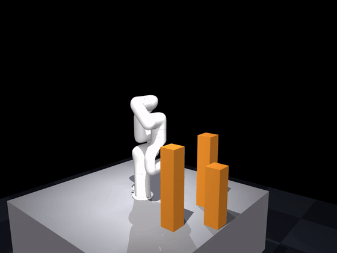
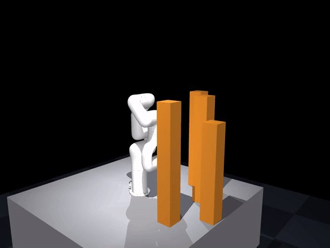
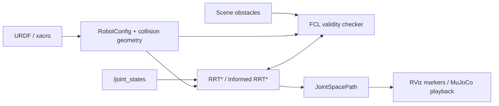
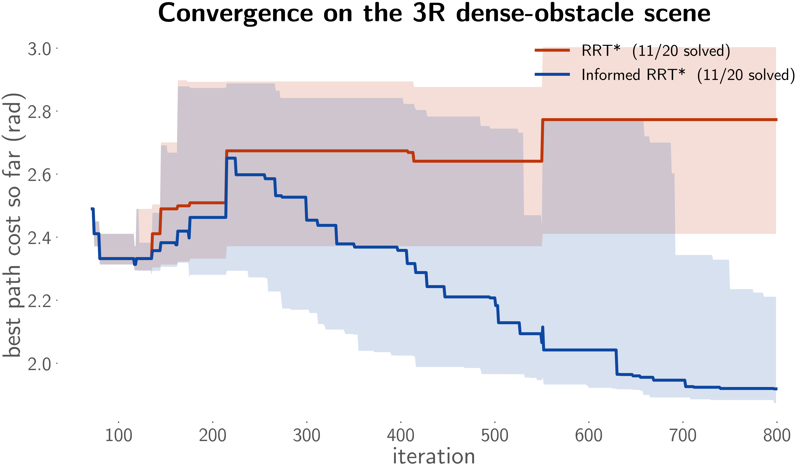

# kinematic_planner_ros2

[](https://github.com/coenwerem/kinematic_planner_ros2/actions/workflows/ci.yml)

**A ROS 2 research and teaching toolkit for sampling-based manipulator motion planning.**

`kinematic_planner_ros2` implements RRT* and Informed RRT* joint-space planning, URDF-driven robot modeling, and FCL-based environment and self-collision checking from first principles. The implementation keeps sampling, nearest-neighbor expansion, rewiring, path validation, collision geometry, and ROS 2 integration explicit, making the stack useful for studying, testing, and extending sampling-based planning methods. The planner core has no ROS dependency. ROS 2 nodes wrap it with robot-state, scene, visualization, and path interfaces.

<p align="center">
  
  
</p>

### Highlights

- **Inspectable planning internals**: sampling, tree expansion, rewiring, collision checking, and the ROS 2 boundary remain explicit end to end.
- **RRT\*** and **Informed RRT\*** implemented directly in Python with rewiring, deterministic sampling, and convergence instrumentation.
- **N-DOF URDF manipulators** with joint limits and kinematic topology parsed directly from the robot description.
- **FCL collision checking** for robot-obstacle and self-collision queries, including primitive and triangle-mesh collision geometry.
- **ROS 2 Jazzy integration** through standard joint states, launch files, visualization markers, and custom path/scene interfaces.
- **7-DOF xArm7 validation** in cluttered scenes, with MuJoCo used to replay and render the planner's verified paths.
- **Reproducible benchmarks and CI** covering planner behavior, collision geometry, self-collision, joint ordering, and launch selection.

> **Project scope:** this repository is intended for research, teaching, and experimentation with sampling-based manipulator planning. It focuses on the planner and collision pipeline and does not attempt to provide the broader trajectory-processing, execution, plugin, and scene-management surface expected from production motion-planning software.

---

## Citation

If `kinematic_planner_ros2`'s planning infrastructure supported your work,
please cite the software directly (see `CITATION.cff`), and consider
citing the related paper below:

```bibtex
@inproceedings{enwerem2026variational,
  title={Variational Neural Belief Parameterizations for Robust Dexterous Grasping under Multimodal Uncertainty},
  author={Enwerem, Clinton and Kalyanaraman, Shreya and Baras, John S. and Belta, Calin},
  booktitle={Proceedings of the IEEE/RSJ International Conference on Intelligent Robots and Systems (IROS)},
  year={2026},
  eprint={2604.25897},
  archivePrefix={arXiv},
  primaryClass={cs.RO},
  note={Accepted for publication}
}
```

---

## Demo

The xArm7 demos use the same planner and FCL validity checker as the ROS 2 package. MuJoCo is used only to replay the resulting joint-space path and render it offscreen.

| Scene | Planning Problem | Media |
|---|---|---|
| `sparse` | 3 pillars requiring a collision-free detour | [GIF](media/xarm7_demo.gif) · [MP4](media/xarm7_demo.mp4) |
| `tall` | 4 taller pillars that force the arm to route under/around the obstacle field | [GIF](media/xarm7_tall_demo.gif) · [MP4](media/xarm7_tall_demo.mp4) |
| `dense` | 6 pillars in a tighter workspace | [GIF](media/xarm7_dense_demo.gif) · [MP4](media/xarm7_dense_demo.mp4) |

For each recording, `tools/render_xarm7_demo.py` verifies that:

1. the straight-line interpolation from start to goal is in collision,
2. every returned planner waypoint is collision-free, and
3. the path starts and terminates at the requested configurations.

The MuJoCo playback provides **kinematic visualization**. Dynamics validation falls outside this demo because the renderer sets joint positions along the planned trajectory directly. Torque limits, contact forces, tracking error, and time parameterization are therefore outside the validation scope.

The bundled xArm7 collision model uses convex primitives. Triangle-mesh collision support is implemented in `collision/robot_collision_model.py` and exercised independently by the collision-model tests.

---

## Architecture



The planning algorithms live in ROS-independent modules under `kinematic_planner/planning/`. ROS 2 nodes translate robot state and scene messages into planner inputs and publish the resulting joint-space path.

### Core Components

| Capability | Implementation |
|---|---|
| RRT* | `planning/rrt_star.py` |
| Informed RRT* | `planning/informed_rrt_star.py` |
| Shared tree and rewiring machinery | `planning/tree.py` |
| URDF robot metadata | `robot/robot_config.py` |
| Robot collision geometry | `collision/robot_collision_model.py` |
| Environment collision checking | `collision/collision_utils.py` |
| Self-collision checking | `collision/self_collision.py` |
| ROS 2 planner nodes | `scripts/planner_node.py`, `scripts/informed_rrt_star_node.py` |
| Robot geometry publisher | `scripts/robot_geom_publisher.py` |
| Scene publisher | `scripts/obstacle_publisher.py` |
| xArm7 MuJoCo renderer | `tools/render_xarm7_demo.py` |
| Benchmark harness | `tools/benchmark_planners.py` |

---

## Benchmark

`tools/benchmark_planners.py` compares RRT* and Informed RRT* on the bundled 3R dense-obstacle scene over 20 deterministic seeds and 800 iterations per trial.

Both planners sample uniformly until the first solution. In the recorded benchmark, **11/20 trials** found a solution within the iteration budget. After the first solution, Informed RRT* restricts sampling to its current admissible ellipsoid and achieved a lower final path cost than RRT* in every solved trial.

```bash
python3 tools/benchmark_planners.py --trials 20 --max-iter 800
```

<p align="center">
  
</p>

The benchmark reports joint-space path cost in radians and focuses specifically on convergence behavior. Wall-clock performance depends on the robot, collision geometry, scene complexity, and hardware.

---

## Quick Start

### Requirements

Tested on:

- Ubuntu 24.04 (Noble)
- ROS 2 Jazzy
- Python 3
- FCL / `python-fcl`

Install the ROS and FCL system dependencies:

```bash
sudo apt install \
  ros-jazzy-xacro \
  ros-jazzy-robot-state-publisher \
  ros-jazzy-joint-state-publisher \
  libfcl-dev
```

Install the Python dependencies:

```bash
pip install \
  "roboticstoolbox-python>=1.3.1" \
  "spatialgeometry>=1.3.0" \
  spatialmath-python \
  transforms3d \
  trimesh \
  python-fcl \
  "numpy>=2.0"
```

MuJoCo and `imageio` are needed only to reproduce the rendered demos:

```bash
pip install mujoco imageio
```

### Build

```bash
git clone https://github.com/coenwerem/kinematic_planner_ros2.git
cd kinematic_planner_ros2
source /opt/ros/jazzy/setup.bash
colcon build
source install/setup.bash
```

### Run RRT*

```bash
ros2 launch kinematic_planner planner.launch.py
```

Plan to another goal configuration:

```bash
ros2 launch kinematic_planner planner.launch.py \
  goal_config:="[1.5, -0.3, 0.6]"
```

### Run Informed RRT*

```bash
ros2 launch kinematic_planner planner.launch.py \
  algorithm:=informed_rrt_star
```

### Visualize the 3R Reference Example

```bash
ros2 launch kinematic_planner planner.launch.py &
rviz2 -d src/robot_3r_description/rviz/view_3r_demo.rviz
```

### Inspect the Published Path

```bash
ros2 topic echo /smpb_planner/jsp_path --once
```

---

## Reproduce the xArm7 Demos

The 3R model is retained as a compact reference and test case. The xArm7 is the realistic 7-DOF demonstration of the same planning stack.

```bash
colcon build --packages-select \
  xarm7_description \
  kinematic_planner_interfaces \
  robot_3r_description \
  kinematic_planner
source install/setup.bash

python3 tools/render_xarm7_demo.py --scene sparse
python3 tools/render_xarm7_demo.py --scene tall
python3 tools/render_xarm7_demo.py --scene dense
```

For the lightweight 3R recording:

```bash
python3 tools/render_demo.py
```

`src/xarm7_description/urdf/xarm7.urdf` and its meshes were adapted from the MIT-licensed [`frogger`](https://github.com/albertli24/frogger) xArm7 model. See `src/xarm7_description/NOTICE.md` for provenance and modifications.

---

## Collision Model

Robot collision geometry is constructed directly from each URDF `<collision>` element. The collision layer supports:

- boxes,
- spheres,
- cylinders,
- triangle meshes through FCL `BVHModel`,
- per-collision `origin` transforms,
- multiple collision elements per link,
- robot-obstacle proximity/collision queries, and
- self-collision checks with adjacent link pairs excluded automatically.

Additional self-collision exclusions can be supplied with `disabled_collision_pairs`, for example:

```bash
ros2 launch kinematic_planner planner.launch.py \
  disabled_collision_pairs:="['base_link:link3']"
```

---

## Using Another Robot

Robot-specific Python classes are unnecessary because the planner derives its model from the URDF.

To add another robot:

1. Add or depend on the robot's URDF/xacro package.
2. Point a launch file at that robot description and pass it to the planner through `robot_description`.
3. Provide any additional non-adjacent self-collision exclusions through `disabled_collision_pairs` if required.
4. Set the example scene's `platform_height` if using the bundled obstacle publisher.

The collision model accepts primitive and triangle-mesh URDF collision geometry. The current planner operates in the full joint space exposed by the URDF. Explicit planning-group selection for large branched robots is outside the current scope.

---

## ROS 2 Interface

The default launch file brings up the robot description, joint-state source, robot geometry publisher, obstacle publisher, and the selected planner.

<details>
<summary><strong>Launch Arguments</strong></summary>

| Argument | Default | Description |
|---|---|---|
| `goal_config` | `[0.8, -0.5, 0.5]` | Goal joint configuration in radians |
| `algorithm` | `rrt_star` | `rrt_star` or `informed_rrt_star` |
| `is_dense` | `false` | Select the dense bundled obstacle scene |
| `check_collision` | `true` | Enable FCL collision checking |
| `collision_checker` | `proximity` | `proximity` or `bvol` |
| `rrts_max_iter` | `2000` | Maximum planner iterations |
| `platform_height` | `0.755` | Mounting-platform height used by the bundled obstacle scene |
| `verbose` | `false` | Enable per-iteration logging |
| `world_frame` | `world` | Fixed frame |
| `base_link_name` | `base_link` | Robot base link |
| `dense_ring_radius` | `0.45` | Dense-scene ring radius in meters |

</details>

<details>
<summary><strong>Planner Parameters</strong></summary>

| Parameter | Default | Description |
|---|---|---|
| `robot_description` | required | URDF XML string |
| `goal_config` | joint-limit midpoints | Goal joint configuration |
| `rrts_expand_dist` | `0.3` | Maximum tree extension per iteration in joint space |
| `rrts_path_resolution` | `0.1` | Edge interpolation resolution in joint space |
| `rrts_max_iter` | `2000` | Maximum iterations |
| `rrts_connect_circle_dist` | `20` | RRT* neighbor-radius multiplier |
| `rrts_search_until_max_iter` | `false` | Continue optimizing after the first solution |
| `use_goal_biased_sampling` | `false` | Enable goal-biased sampling for RRT* |
| `rrts_goal_sample_rate` | `0.3` | Goal-bias probability when enabled |
| `collision_checker` | `proximity` | Signed-distance or collision-query mode |
| `min_obs_dist` | `0.1` | Minimum obstacle clearance in meters |
| `random_seed` | `42` | Deterministic RNG seed |
| `disabled_collision_pairs` | `[""]` | Additional self-collision exclusions as `link_a:link_b` strings |

</details>

---

## Testing

Run the package tests after building and sourcing the workspace:

```bash
colcon test --event-handlers console_direct+
colcon test-result --verbose
```

The test suite covers planner cost/rewiring behavior, deterministic sampling, informed-set sampling, start/goal validity, collision geometry transforms, mesh geometry, multiple collision shapes, self-collision exclusions, scrambled `JointState` ordering, and launch selection.

CI is defined in `.github/workflows/ci.yml`.

---

## Project Structure

<details>
<summary><strong>Repository Layout</strong></summary>

```text
kinematic_planner_ros2/
├── src/
│   ├── kinematic_planner/
│   │   ├── launch/
│   │   │   └── planner.launch.py
│   │   └── kinematic_planner/
│   │       ├── planning/          # ROS-independent RRT* implementations
│   │       ├── collision/         # FCL geometry and validity checking
│   │       ├── robot/             # URDF-derived robot metadata
│   │       └── scripts/           # ROS 2 nodes
│   ├── kinematic_planner_interfaces/
│   ├── robot_3r_description/
│   └── xarm7_description/
├── test/
├── tools/
│   ├── benchmark_planners.py
│   ├── render_demo.py
│   └── render_xarm7_demo.py
└── media/
```

The custom FK/Jacobian/IK implementation in `robot/legacy/urdf_parser.py` is retained as an educational reference. Runtime planning uses the modules under `planning/`, `collision/`, and `robot/robot_config.py`.

</details>

---

## Scope

This package focuses on **kinematic joint-space sampling-based planning** for research, teaching, and experimentation. Its current scope covers planner construction, URDF-derived robot models, collision checking, ROS 2 interfaces, simulation playback, and reproducible benchmarks. It currently does not provide:

- trajectory time parameterization,
- kinodynamic planning,
- dynamics or actuator feasibility checks,
- dynamic-obstacle replanning,
- MoveIt planner-plugin integration, or
- explicit planning-group selection for branched robots.

These boundaries keep the planner and collision pipeline small enough to inspect end to end and make it practical to modify individual planning components without carrying a production framework's full integration surface.

---

## References

- S. Karaman and E. Frazzoli, “Sampling-based algorithms for optimal motion planning,” *IJRR*, 2011.
- J. D. Gammell, S. S. Srinivasa, and T. D. Barfoot, “Informed RRT*: Optimal Sampling-based Path Planning Focused via Direct Sampling of an Admissible Ellipsoidal Heuristic,” *IROS*, 2014.
- Planner implementation structure was initially adapted from [AtsushiSakai/PythonRobotics](https://github.com/AtsushiSakai/PythonRobotics) and subsequently generalized for ROS 2 manipulator planning.

## License

MIT. See [`LICENSE`](LICENSE).
